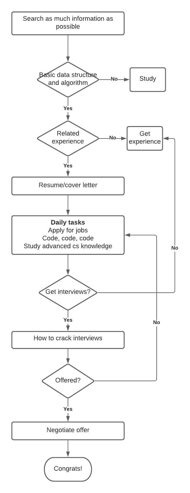

Read [this](https://github.com/firstcontributions/first-contributions) about how to become a contributor for the repository. Only 4 steps: *fork -> clone -> edit -> pull request*

> Job search can be fun. This is the time when you have an in-depth understanding of yourself, your past experience, and your future plans.
Most of all, you will study and become a better person. 
After three months of job search, you may say "I am more knowledgeable than me three months ago"

### Who should read this
- You are looking for jobs in software engineering 
- You want to know those things that help you land a job, including 
resume/cover letter, job application, interviews, and offers, 
- You want to know what to study and how much you should study to get a job

### What are the differences between this and other materials

- It provides short but valuable information based on experiences and other sources. In other word, it provides the meaty content.
- It demonstrates a comprehensive job search process

### Here is the process of job search
 

 
### Table of content
- [Search as much information as possible](#search-as-much-information-as-possible)
- [Basic data structure and algorithm](#basic-data-structure-and-algorithm)
- [How to get related experience](#how-to-get-related-experience)
- [Resume/cover letter](#resume-cover-letter)
- [Daily tasks](#daily-tasks)
    - [Tips for applying for jobs](#tips-for-applying-for-jobs)
    - [Code, code, code](#code-code-code)
    - [Study advanced cs knowledge](#study-advanced-cs-knowledge)
- [How to crack tech interviews](#how-to-crack-tech-interviews)
    - [Typical interview process](#typical-interview-process)
    - [Before the interview](#before-the-interview)
    - [During the interview](#during-the-interview)
    - [Post interview](#post-interview)
- [Negotiate job offers](#negotiate-job-offers)
- [Tech company interviews](#tech-company-interviews)
- [Study](#study)

# Search as much information as possible

Before you start to take any action, it would be a good idea to learn from others' experiences.
It can make sure you are in the right track of landing a job and 
help you avoid some failures. 
First of all, go through this repository.

If you have enough time, read the following materials to prepare for your interviews: 
- Cracking the coding interview by Gayle Laakmann McDowel
- [How to Break Into the Tech Industry—a Guide to Job Hunting and Tech Interviews](https://haseebq.com/how-to-break-into-tech-job-hunting-and-interviews/)
- [How to Pass the Engineering Interview in 2021](https://davidbyttow.medium.com/how-to-pass-the-engineering-interview-in-2021-45f1b389a1)
- [Tech Interview Handbook](https://techinterviewhandbook.org/)
- [Coding Interview University](https://github.com/jwasham/coding-interview-university)

# Basic data structure and algorithm
Below is a sheet of basic data structure and algorithm you should know

|Data structure| Algorithm | Others |
|-|-|-|
|String| Breadth-First Search (BFS), Depth-First Search(DFS) | Big O Time & Space |
|Array, Linked Lists| Binary Search, Divider and Conquer | Recursion |
|Stacks & Queues| Quick Sort, Merge Sort | Bit Manipulation |
|Trees, Tries, & Graphs| Dynamic Programming ||
|Heaps |||
|Hash Tables |||

 For each topic, make sure you know 
 - What it is
 - How to implement it
 - Where applicable
 - Time and space complexity
 

Check [Study/Data structure and algorithm](##Data structure and algorithm) for more information
 

# How to get related experience
To get an interview, you need an impressive resume; To have an impressive resume, you need great and related experience. 
"Great" means it has an impact on others, the society, or just yourself. "Related" means your experience matches at least 50% of the job requirements.
For software engineering roles, your experience should be related to coding. 

You might get experience from 
- Work. 
- School projects.
- Personal projects. Build an mobile/web app, games. 

If you want more experience on specific skills such as Python, Java, you can build the projects while studying for those skills
from the sources below.
- Udacity. Pros: detailed explanation and project guides. Cons: expensive
- Udemy. Pros: cheap and clear study guide. Cons: lack of your ideas
- Books. Pros: cheap. Cons: hard to find good books
    
The best way to learn a new skill is to imitate. 

# Resume cover letter 
### Resume tips
- One page long. More than one page or less than one page is bad if you have less than 10 years experience.
- Follow X-Y-Z rule for employment experience: "Accomplished X by implementing
Y which led to Z". 

    Show what you did, how you
did it, and what the results were. Try to make the results "measurable"

    Here are an example from Cracking the coding interviews
"Reduced object rendering time by 75% by implementing distributed caching, leading to a 10% reduction
in log-in time"

- For project
    - List 2 - 4 projects
    - One sentence to introduce the goal of the project
    - List the main functions of the projects are that can show yours skills
    - Add impact of this project such as "1000 downloads"
    
- Use action words such as Achieved, Expanded, Advanced. 
Check [Action Words for Engineering](https://www.engineering.cornell.edu/sites/default/files/users/user240/Action%20Words%20for%20ENG%20(website).pdf) that covers action words in different aspects 

### Resume template
- Overleaf template. [TonyStack_SoftwareEngineer_Resume](downloads/main.tex). Overleaf is a great tool for resumes. You can add multiple experiences without worrying about the format. The format is consistent with the same command. 
Read [Learn LaTeX in 30 minutes](https://www.overleaf.com/learn)
- Word template. https://www.crackingthepminterview.com/resources.html

 
### Cover letter
- Short. around 200 - 250 words
- Show passion about the technology and the industry
- Show desired skills for the position, or general. Such as python developer vs software engineer
- Matches the Company Culture
- Well Written. No spelling or grammar errors. Don’t get too long or complex

#### Other sources
- I strongly recommend you read Chapter 7 to 9 from *Cracking the PM Interview* about resume and cover letter
- do's and don'ts in a resume. https://techinterviewhandbook.org/resume

# Daily tasks
## Make a plan
It is always good to make plans beforehand. You daily plan should include
- How many jobs to apply 
- How many coding questions to solve 
- What subject to study

A possible plan would be
- Apply at least 5 jobs in 2 hrs
- Solve 3 to 5 questions in 4 hrs
- Study Design Pattern for 3hrs

## Tips for applying for jobs
- Position. Match your skills with jobs (Important for college students and new grads)
    (TBD)
- Networking (Recommend)
    - Friends/classmates/professors. Send an email or message to them and tell them you are looking for jobs. Ask them for advice or referral
    - Linkedin. 
        - Connect your alumni/friends/recruiters/employees in a company you are interested in. 
        Expand your network by adding people you don't know but you want to know
        - Tell your connection about who you are and why you are interested in the role and company, then ask for referral politely.
        Sometimes people would love to help you just because they can feel the struggle of searching for jobs
        - Get LinkedIn Premium. Set your profile to be open. It will boost your chance to let recruiter know you. 
        - Search people tagged by "#hiring" and connect with them or send them inMail.
        
    - Pramp. Pramp is a website that you can practice mock interviews with peers or friends. It matches peers who are preparing for interviews. 
    It includes coding questions, behavior questions, and system design. 
    The best thing about Pramp is that you can make a good relationship with peers. You can help each other by practicing interviews, asking referrals.  
    Pramp is free. But You need credits to schedule an mock interview. One credit per practice. 
    Register using my link: https://www.pramp.com/invt/lYAX1pZJoMCmZJ00xmoa. Both can get extra credits.
    
    - 1point3acres (for chinese speakers)
 
- Company website/career
    
- JobBoard
    - Linkedin
    - Handshake. Internship
    - AngelList. startups and tech companies
    - Triplebyte. 
    - Indeed
    - Glassdoor
    

The priority of applying jobs.
networking > company website > JobBoard

Networking takes more time than the other two but it is totally worthy.

## Code code code
- Start with Cracking the Code Interview. Pros: There are 189 programming questions and answers. You can practice 3 ~ 5 questions for each topics in data structure and algorithm. Then repeat the process. Cons: You have to write the test cases.
- Leetcode. Solve medium and hard questions. Pros: abundant questions and test cases. Cons: too many questions. You can join leetcode daily challenge and weekly challenge to narrow down your options.

It doesn't matter which coding platform you choose, pick one and practice on the platform every day.

#### How to approach an coding questions?
- Understand the question. 
- Brute force solution
- Complexity analysis
- Optimize if applicable. 
- Code
- Review your code
- Test. Edge cases

I encourage you to code every solution when you are practicing, but unnecessary when you are interviewing. 

### Other sources
- [Leetcode Effectively](https://dandkim.com/leetcode-effectively/)

## Study advanced cs knowledge
(TBD)

# How to crack tech interviews
    
## Typical interview process
- 1 round HR phone screen (20 ~ 30 mins)
- 1 round technical screen (45mins) or online assessment (2 coding questions for 2 hrs)
- (Virtual) onsite 3 ~ 6 rounds (45 ~ 60 mins each round)
    - Data structure and algorithm
    - Behavior questions
    - Technical/project deep dive
    
    Optional
    - OOD
    - System Design
    

[Demystifying Tech Recruiting](https://www.youtube.com/watch?v=N233T0epWTs) (video)

## Before the interview
- Use notebooks to record all company you interviewed. I created a [job application template](https://www.notion.so/Job-Applications-f24bdeaa305742569202a01f46349f34) on Notion
- Company search. Basic questions "why do you wanna work here"
- Search for interviews questions from Glassdoor/Google/leetcode/1point3acres. 
    Coding questions are arbitrary, but you will get an idea of how difficult the questions can be
- Email HR about the process and content of the interview
- Review your notes about coding templates such as binary search, quicksort, mergesort
- Prepare for MUST questions and behavior questions 
- Mock interview (very important). Do that even when you don't have interviews
    - Friends
    - Educating.io
    - Pramp

### Coding interview
- Whiteboard 
    - [Amazon Coding Sample](https://www.youtube.com/watch?v=mjZpZ_wcYFg) 

### MUST questions
There are some interview questions you can expect - questions about you, company, job
- Tell me a bit about yourself.
    - Think about what you want the interviewer to know about your background, experiences, and interests. Connect elements of your pitch to what the company is looking for.

    - Highlight the most interesting or relevant parts of your jobs. This is your opportunity to sell yourself.

    - Don’t just list off your accomplishments. Don’t get overly technical. Don’t speak too abstractly

- Why do you want to work here?
    - What do you like about this position
    - What do you like about the team
    - What do you like about the company, the mission

- Why should we hire you?
    - How your background, experience match the job 
    - You passion about this job

- Why do you leave current job
- What do you like to do in your spare time
- Where do you see yourself in 5 years?

- Do you have any questions for me?

    Sample questions 
    - What’s a typical day like as a xxx here? 
    - What does success look like for your team/project?
    - What are the challenges that the company/team is facing?
    - What do you find most challenging about being a XXX here?
    - What’s your favorite part about working here?
    - What would make someone the ideal xx candidate for you?
 
    You can find more questions below
    - https://techinterviewhandbook.org/questions-to-ask

### Behavior Questions AKA BQ
A behavior questions can be "tell me a time when you met a challenge/failure/success/conflict"

Reasons for Behavior questions
- Verify your past experience. You did what you said on resume
- Know how big your accomplishment is
- Know your skills and attributes for the job

All those questions can be well prepared before the interview

1. Brainstorm all your latest experiences from work, project, extracurricular
2. Create a Preparation Grid and write down as many stories as possible that covers at least one area (Leadership/Teamwork/Successes/Challanges/Mistakes)
Check [behavior_preparation_grid](downloads/behavior_preparation_grid.xlsx) from https://www.crackingthepminterview.com/resources.html

3. Master 5 best stories from your experience 

    ***How to define a good story?***
    - The story shows that your accomplishment is substantial such as optimize/create something or solve an problem.
    - The story is easy to understand, less technical.
    - The story shows interviewers your good personalities such as creativity/curiosity/understanding/anaytical/data-driven/leadership/influence others
    - The story is about you, not teams

4. Structure your story with S.A.R (Situation, Action, Result)

    Start your story with a topic sentence such as "The challenge I met is that how to shorten the query time in data warehouses". 
    
    Then organize your story with S.A.R structure 
    - Situation: background and why it mattered 
    - Action: the action you took to handle the challenge/failure/leadership/success. You can speak in bullets. First, .... Second, .... Third, ... 
    - Result: how your actions help the team and company? If it is possible, try to make your impact measurable.

5. Follow-up questions from interviewers
    - What do you learn from this?
    - What would you do differently if the this situation came up again?
    - How did the team react?

#### Other sources
- Crack the PM Interview
- [Grokking the Behavioral Interview](https://www.educative.io/courses/grokking-the-behavioral-interview)

### Technical deep dive
Technical deep dive is to ask you to share a technical project you worked on or technical experience you had. 

You should prepare a story that includes
- Background
- Your actions. 
- Describe the Trade-off of different solutions. Why did you use certain solution
- Result of the story. Evaluate your action

Follow up questions.
- Why use this framework/database
- Why not use other framework/database, what are the trade-offs?
- What is the technology you use? explain it
        

## During the interview
- Don't have any expectations. Never expect anything such as offers or failures.
- Think before you speak. Otherwise, don't talk.  
- Keep in mind you are learning from the interviews. 
- Relax and enjoy.

## Post interview
- Make sure you get the interview result. If you don't get the result in 3 ~ 5 days, 
send the recruiters an email and ask for the result. Sometimes, you may miss their calls.
 
- Whether you are offered or not, make notes and review your interview process. 

# Negotiate job offers
- [Tech Interview Handbook](https://techinterviewhandbook.org/negotiation). I strongly recommend you to read this about how to negotiate offers and understand compensation
- Cracking the Code Interview. Chapter VIII - The Offer and Beyond from 
- [Ten Rules for Negotiating a Job Offer](https://haseebq.com/my-ten-rules-for-negotiating-a-job-offer/)

# Tech company interviews
## Amazon
- [Cracking the top Amazon coding interview questions](https://www.educative.io/blog/crack-amazon-coding-interview-questions#questions)
- Amazon behavior question   
Our interviews are rooted in behavioral-based questions which ask about past situations or challenges you’ve faced and how you handled them, using Leadership Principles to guide the discussion. We avoid brain teasers (e.g., “How many windows are in Manhattan?”) as part of the interview process. We’ve researched this approach and have found that those types of questions are unreliable when it comes to predicting a candidate’s success at Amazon.
    - https://www.amazon.jobs/en/principles
    

# Study

Data Structure and Algorithm

Operating System

Computer Network

Computer architecture and organization

Linux

Java

## Python
- [Web Developer Bootcamp with Flask and Python](https://www.udemy.com/course/web-developer-bootcamp-flask-python/learn/lecture/21050580?start=0#content)
- [Python Crash Course, 2nd Edition: A Hands-On, Project-Based Introduction to Programming](https://www.amazon.com/Python-Crash-Course-2nd-Edition/dp/1593279280)

Software Engineering
- OOD
- Agile

AWS

Hadoop/Spark/Flink

